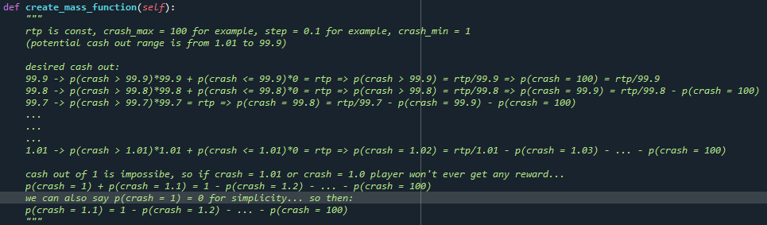
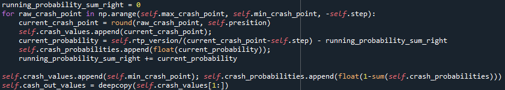
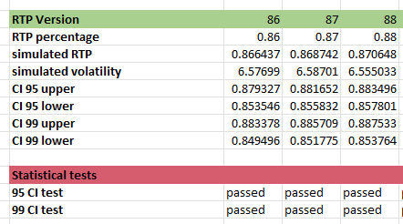

# Math-Practice
Aviator game calculation and simulation with statistical tests

## calculation

- deriving mass function for every crash_point in range [min_crash_point, max_crash_point]

🐍[Explained Math](https://github.com/Jankoetf/Math-Practice/blob/main/aviator_class.py)

- calculation algorithm

- simulation and statistical tests

🐍[Tests](https://github.com/Jankoetf/Math-Practice/blob/main/StatisticalTests.xlsx)

